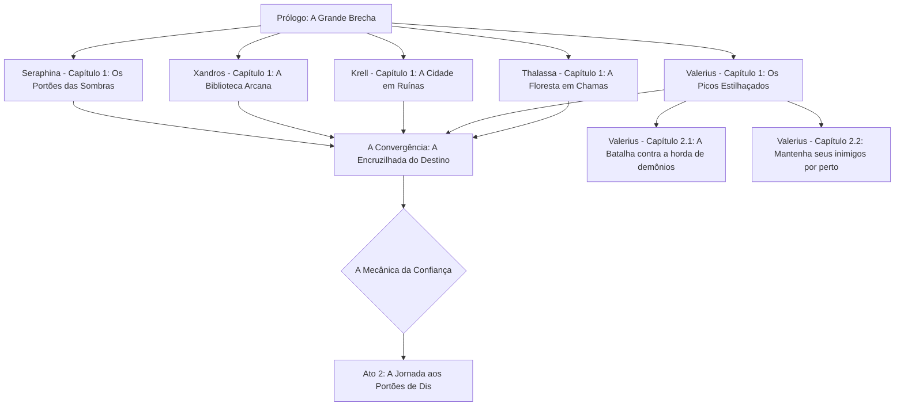

# A Legião do Abismo

Gênero: Fantasia Épica / Comédia Sombria
Classificação: 16+

## Sinopse

Desde que o universo foi criado, uma ordem frágil mas funcional separava os três planos da existência: a Luz, o Meio e o Abismo. Frágil porque dependia, em grande parte, de Lúcifer — o único ser temido o suficiente para manter os demônios em linha. Funcional porque, bem, ninguém havia tentado derrubá-la ainda.
Até agora.
Após uma rebelião que surpreendeu até os próprios rebeldes pela sua eficiência, os seis Príncipes do Pecado aprisionaram Lúcifer numa prisão interdimensional e voltaram seus olhares ambiciosos para o Meio. O plano é simples: invadir, destruir a hierarquia celestial e infernal de uma vez por todas, e reconstruir o cosmos segundo seus próprios — e muito discutíveis — valores.
À frente da invasão está Asmodeus, irresistível e implacável. Ao seu lado: um demônio que devora almas como aperitivo, outro que já está calculando o valor de mercado da humanidade, um destruidor que expressa seus sentimentos exclusivamente através de explosões, um leviatã ciumento que vai emergir pelos oceanos, e um príncipe da preguiça que topou tudo desde que não precisasse levantar da cama.
O que poderia dar errado?
Tudo. Absolutamente tudo.

## Sobre a obra
Escrita no estilo das grandes narrativas épicas de fantasia — com a riqueza de mundo e a seriedade de voz características de Tolkien — As Legiões do Abismo subverte o gênero ao colocar seus vilões no centro da história. Aqui, o mal não é uma força sombria e monolítica: é uma coleção de personalidades incompatíveis, motivações contraditórias e egos descomunais tentando, contra todas as probabilidades, trabalhar em equipe.
A obra explora, com humor sombrio e afeto genuíno pelos seus personagens improváveis, temas como poder, ambição, identidade e o que acontece quando criaturas definidas por seus pecados tentam construir algo juntas — sem matar umas às outras primeiro.

## Por que ler?

Vilões carismáticos e genuinamente engraçados no centro da narrativa
Worldbuilding rico, com mitologia própria e lore profundo
Humor inteligente que não sacrifica a épica
Personagens que você vai odiar amar — e amar odiar
Uma visão original do inferno, do céu e de tudo que fica no meio

## 🛡️ A Vanguarda da Terra: Os "Porta-Crashers"
Aqui está nosso time de cinco heróis. Temos uma mistura de pancadeiros pesados, desastres elementais e um cara que definitivamente passou tempo demais na biblioteca.

| Herói | Classe | Vibe Check | Estilo de Combate | 
| --- | --- | --- | --- | 
| Thalassa "A Raiz" | Guardiã Primordial | 🌿 "Sai do meu jardim... e do meu planeta." | Controle de multidão com vinhas sencientes e pancadas pesadas de cajado. | 
| Valerius Bolt | Valquíria Coroada pela Tempestade | ⚡ "Eu sou o raio e o trovão." | Ataques aéreos de alta mobilidade e lanças de relâmpago perfurantes. | 
| Krell, o Inquebrantável | Juggernaut Rúnico | 💪 "Esse portal parece socável? Parece." | Força física bruta infundida com runas cinéticas crepitantes. | 
| Arquivista Xandros | Mago de Batalha Eldrítico | 📖 "Eu li sobre isso num livro. Termina muito mal pra você." | Conjuração tática, armadilhas de glifos e feixes de energia de longo alcance. | 
| Seraphin Noir | Inquisidora Forjada no Inferno | ⚖️ "Confiar é difícil. Trair é fácil." | (A carta fora do baralho!) Furtividade, dual wield de adagas sagradas com uma pitada demoníaca. | 

## 🗺️ O Pipeline "Como-Salvar-o-Mundo"
Já que estamos fazendo a abordagem de "Origens Individuais", aqui está o fluxo narrativo dos primeiros atos. É como um trabalho em grupo de alto risco onde ninguém sabe ainda que está no mesmo grupo! 🤝

## Heaven and Hell

Heaven and Hell é um RPG focado em escolhas morais, gestão de confiança e as consequências brutais da invasão do Inferno na Terra.

## 📝 O Prólogo: [O Tumulto das Profundezas](/history/o_tumulto_das_profundezas.md)

## Capítulo 1: [O primeiro portão no ponto mais alto do Meio](/history/valerius_bolt.md)

.
.
.

