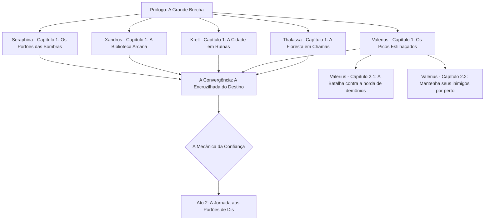

# h-h
## 🛡️ A Vanguarda da Terra: Os "Porta-Crashers"
Aqui está nosso time de cinco heróis. Temos uma mistura de pancadeiros pesados, desastres elementais e um cara que definitivamente passou tempo demais na biblioteca.

| Herói | Classe | Vibe Check | Estilo de Combate | 
| --- | --- | --- | --- | 
| Thalassa "A Raiz" | Guardiã Primordial | 🌿 "Sai do meu jardim... e do meu planeta." | Controle de multidão com vinhas sencientes e pancadas pesadas de cajado. | 
| Valerius Bolt | Valquíria Coroada pela Tempestade | ⚡ "Eu sou o raio e o trovão." | Ataques aéreos de alta mobilidade e lanças de relâmpago perfurantes. | 
| Krell, o Inquebrantável | Juggernaut Rúnico | 💪 "Esse portal parece socável? Parece." | Força física bruta infundida com runas cinéticas crepitantes. | 
| Arquivista Xandros | Mago de Batalha Eldrítico | 📖 "Eu li sobre isso num livro. Termina muito mal pra você." | Conjuração tática, armadilhas de glifos e feixes de energia de longo alcance. | 
| Seraphina Noir | Inquisidora Forjada no Inferno | ⚖️ "Confiar é difícil. Trair é fácil." | (A carta fora do baralho!) Furtividade, dual wield de adagas sagradas com uma pitada demoníaca. | 

## 🗺️ O Pipeline "Como-Salvar-o-Mundo"
Já que estamos fazendo a abordagem de "Origens Individuais", aqui está o fluxo narrativo dos primeiros atos. É como um trabalho em grupo de alto risco onde ninguém sabe ainda que está no mesmo grupo! 🤝

## 📝 A Introdução: "Quem Deixou a Porta Aberta?"
O céu não caiu; ele ficou da cor de um roxo pisado e começou a vazar demônios. 😈

Tudo começou ao Meio-Dia. Pelo mundo inteiro, os "Portões de Geena" se manifestaram — estruturas colossais de obsidiana e osso que cheiravam vagamente a enxofre e arrependimento. Para a maioria das pessoas, era o fim do mundo. Para os nossos heróis, era uma entrevista de emprego para a qual nunca se inscreveram.

**Thalassa** está atualmente ocupada transformando uma horda de Cães do Inferno em adubo no Bosque Sagrado. 🌳

**Valerius** está atualmente dando um "choque de realidade" em demônios estagiários no topo dos Picos Estilhaçados. ⚡🏔️

**Krell** está literalmente segurando um portal fechado com as próprias mãos porque está irritado demais para deixá-lo abrir. 😤

**Xandros** está desesperadamente procurando um feitiço de "Dispensar o Mal Maior" enquanto sua biblioteca queima ao redor dele. 📚

**Seraphina**? Ela está observando das sombras, pensando em qual lado vai pagar melhor... ou qual vai precisar ser esfaqueado primeiro. 🗡️

A virada? Os Céus não estão vindo ajudar. Os Portões Dourados estão trancados a sete chaves. Parece que os Anjos decidiram "trabalhar de home office" enquanto a Terra queima. 😇🚫

De qual perspectiva de herói vamos mergulhar primeiro para fechar o respectivo portão? 🎮✨

Muito bem, Jogador 1! Você escolheu Valerius Bolt, o para-raios humano com atitude. ⚡️

Estamos bem acima dos Picos Estilhaçados, onde o ar é rarefeito, os raios são frequentes e, aparentemente, o GPS demoníaco está com defeito. Valerius está em uma saliência precária, lança crepitante, quando dois demônios — que parecem mais confusos do que assassinos — tropeçam para fora de uma fenda cintilante. 🌀

## 🎙️ O Diálogo: "Perdidos na Tradução (e nas Dimensões)"
**Demônio A** (um sujeito vermelho e esguio segurando um mapa de cabeça pra baixo): "...Eu te digo, Malphas, as instruções diziam 'Vire à esquerda no vazio que grita.' Isso aqui parece um vazio que grita pra você?"

**Demônio B** (um imp baixinho e robusto com asas pequenas demais pro seu corpo): "Tá claro demais, Slag. Meus olhos estão fazendo aquela coisa de 'queimar', e não o tipo bom de queimar. Ei — olha! Um morador!"

**Valerius**: [Apontando a lança, faíscas dançando entre seus olhos] "Morador? Eu sou a dona do pedaço, e o aluguel de vocês é pago em raios. O que vocês estão fazendo nos Picos?"

**Slag** (Demônio A): "Calma, calma! Pera com esse bastão brilhante, moça! Estamos procurando o Ponto de Invasão 4-B: O Buffet Eterno. Falaram que ia ter aldeões indefesos e talvez um arsonzinho leve. Isso aqui parece só... pedras. Isso é o Inferno?"

**Valerius**: "Isso é a Terra. E vocês estão a cinco segundos de virarem uma mancha de carvão nessas rochas."

**Malphas** (Demônio B): "Terra? Que nojo. Ouvi dizer que eles têm 'imposto de renda' e 'ansiedade social' por aqui. Olha, moça, se você só nos apontar de volta pro portal mais próximo, a gente some. Somos só estagiários, juro. Nem plano odontológico a gente tem."

## 🎮 A ESCOLHA É SUA
Valerius está na beira do penhasco. O vento está uivando e a lança dela está faminta por uma descarga. Como vamos lidar com esses "estagiários" do submundo?

| Opção | Ação | Consequência Provável |
| --- | --- | --- |
| **Opção A** | "Choque e Pavor" (Lutar) | ⚡️ Você os reduz a cinzas. Mas espera! Antes da faísca final, eles mandam uma "avaliação de 1 estrela" de volta pro Inferno, avisando todo mundo que a Terra é picante e precisa de reforços. |
| **Opção B** | "Devolva ao Remetente" (Deixar ir) | 🚪 Você os deixa coxear de volta pelo portão e o fecha atrás deles. O Porém: Eles ficam vivos, e embora pareçam inofensivos agora, talvez apareçam no pior momento possível pra estragar o seu dia. |

## ⚡ CAMINHO A: A Rota do "Zapa Primeiro, Pergunta Nunca"
Nessa versão, Valerius decide que o único demônio bom é um demônio aterrado. Mas esses não são mobs de lixo comuns; eles têm uns truques na manga encardida.

### ⚔️ Encontro de Batalha: Valerius vs. Os Estagiários Perdidos

| Entidade | Habilidade Especial | Efeito |
| --- | --- | --- |
| **Slag** | Aura de Isolamento | Um buff passivo que reduz o dano de Raio em 50%. 🧤 |
| **Malphas** | Para-Raios | Uma habilidade canalizada que redireciona os raios de Valerius para a terra. ⚡️🚫 |

**A Luta:**
Valerius avança, mas a pele de Slag fica de um cinza fosco e emborrachado. A lança ricocheteia! Malphas ri, enfiando um bastão de ferro serrilhado na falésia que suga seu raio em cadeia direto do ar. É uma batalha extenuante, forçando Valerius a usar a lança de forma física em vez de apenas seus zaps chamativo. Por fim, com uma pancada devastadora de cima pra baixo, ela destroça o bastão e perfura os dois demônios.

**As Consequências:**
Enquanto Malphas cospe icor preto, ele rabisca freneticamente num pedaço de pergaminho chamuscado.

"A Terra é... tosse... picante. Mandem os pesados..." 📝🔥

Ele joga o papel para o ar. Ele se transforma num aviãozinho de papel em chamas e dispara pela fenda que fecha. Do outro lado, um enorme Comandante da Fossa de quatro braços o pega, lê, e sorri. De repente, o céu sobre os Picos fica vermelho-sangue. Uma Horda está vindo para Valerius. 🏃‍♀️💨

## 👣 CAMINHO B: A Rota do "Mantenha Seus Inimigos por Perto"
Valerius abaixa a lança. "Tá bom. Fechem esse buraco e somam. Se eu ver vocês de novo, faço um casaco com as asas de vocês." Os demônios correm pelo portal, gaguejando agradecimentos.

### 🕵️‍♂️ Missão Furtiva: Rastreando a Debandada
Valerius não confia neles nem um segundo. Ela ativa o Manto Estático (que borra sua silhueta) e os segue pelo portal que fecha no último milissegundo.

**A Descoberta:**
Ela segue os dois idiotas enquanto eles caminham em direção ao "Buffet Eterno". Não é um restaurante. É um vale — e está apinhado de portões.

**O que ela vê:** Em vez de uma pequena brecha, há dúzias de arcos de obsidiana.

**A Escala:** Milhares de demônios se organizam em fileiras. Não é uma incursão; é uma colonização em grande escala. 🛡️👹

**A Realização:** Slag e Malphas eram só a ponta do iceberg. Valerius percebe que não consegue enfrentar isso sozinha. Ela precisa dos outros.
