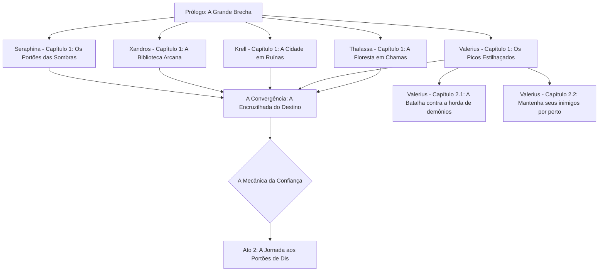
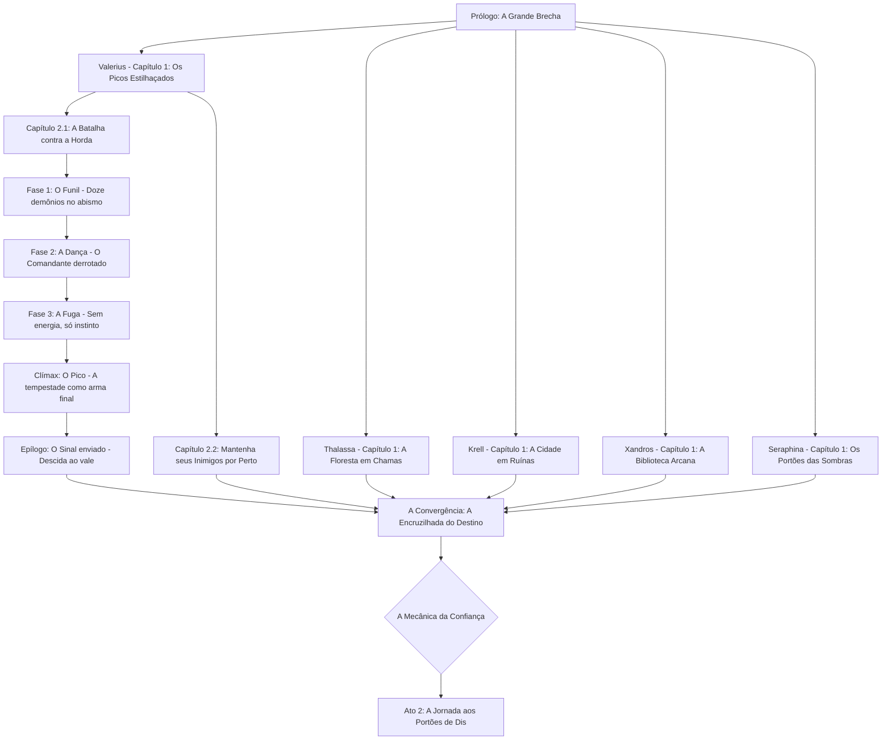

# h-h
## 🛡️ A Vanguarda da Terra: Os "Porta-Crashers"
Aqui está nosso time de cinco heróis. Temos uma mistura de pancadeiros pesados, desastres elementais e um cara que definitivamente passou tempo demais na biblioteca.

| Herói | Classe | Vibe Check | Estilo de Combate | 
| --- | --- | --- | --- | 
| Thalassa "A Raiz" | Guardiã Primordial | 🌿 "Sai do meu jardim... e do meu planeta." | Controle de multidão com vinhas sencientes e pancadas pesadas de cajado. | 
| Valerius Bolt | Valquíria Coroada pela Tempestade | ⚡ "Eu sou o raio e o trovão." | Ataques aéreos de alta mobilidade e lanças de relâmpago perfurantes. | 
| Krell, o Inquebrantável | Juggernaut Rúnico | 💪 "Esse portal parece socável? Parece." | Força física bruta infundida com runas cinéticas crepitantes. | 
| Arquivista Xandros | Mago de Batalha Eldrítico | 📖 "Eu li sobre isso num livro. Termina muito mal pra você." | Conjuração tática, armadilhas de glifos e feixes de energia de longo alcance. | 
| Seraphin Noir | Inquisidora Forjada no Inferno | ⚖️ "Confiar é difícil. Trair é fácil." | (A carta fora do baralho!) Furtividade, dual wield de adagas sagradas com uma pitada demoníaca. | 

## 🗺️ O Pipeline "Como-Salvar-o-Mundo"
Já que estamos fazendo a abordagem de "Origens Individuais", aqui está o fluxo narrativo dos primeiros atos. É como um trabalho em grupo de alto risco onde ninguém sabe ainda que está no mesmo grupo! 🤝

## Heaven and Hell

Heaven and Hell é um RPG focado em escolhas morais, gestão de confiança e as consequências brutais da invasão do Inferno na Terra.

## 📝 A Introdução: "Quem Deixou a Porta Aberta?"

Gehenna, o submundo, um lugar de tormento e sofrimento, está em guerra consigo mesmo. Os demônios lutam entre si pelo poder e controle, após uma grande rebelião, os demonios prenderam o lúcifer em uma prisão interdimensional e agora decidiram invadir a terra com o propósito de destruir toda hieraquia de céu e inferno.

Asmodeus, o demônio associado ao pecado da luxúria, com sua incontrolavel paixao e instintos carnais, é o líder da invasão. Ele é um demônio poderoso e astuto, e conseguiu persuadir seus irmãos, os outros 5 príncipes do inferno, a se juntarem a ele na invasão da terra.

Belzebu, o demônio associado ao pecado da gula, possui uma fome insaciável por poder e controle, com seu poder te absorcao, ele consegue absorver a alma de seus inimigos e se tornar mais poderoso.

Mammon, o demônio associado ao pecado da avareza, aceitou a proposta de asmodeus sem pensar duas vezes, afinal, na terra ele poderia roubar todas as almas que quisesse.

Azazel, o demônio associado ao pecado da ira, com seu poder de destruição, foi essencial para abertura dos portões de Gehenna.

Leviatã, o demônio associado ao pecado da inveja, conhecido por ser um monstro marinho, tem um papel fundamental na invasão pelo mar na terra.

Belphegor, o demônio associado ao pecado da preguiça, só quer ver o caos desde que não tenha que fazer nada.

Agora que nossos vilões foram apresentados, e o principe dos demonios, Lúcifer, está preso a invasão da terra está prestes a começar.

O céu não caiu; ele ficou da cor de um roxo pisado e começou a vazar demônios. 😈

Tudo começou ao Meio-Dia. Pelo mundo inteiro, os "Portões de Geena" se manifestaram — estruturas colossais de obsidiana e osso que cheiravam vagamente a enxofre e arrependimento. Para a maioria das pessoas, era o fim do mundo. Para os nossos heróis, era uma entrevista de emprego para a qual nunca se inscreveram.

**Thalassa** está atualmente ocupada transformando uma horda de Cães do Inferno em adubo no Bosque Sagrado. 🌳

**Valerius** está atualmente dando um "choque de realidade" em demônios estagiários no topo dos Picos Estilhaçados. ⚡🏔️

**Krell** está literalmente segurando um portal fechado com as próprias mãos porque está irritado demais para deixá-lo abrir. 😤

**Xandros** está desesperadamente procurando um feitiço de "Dispensar o Mal Maior" enquanto sua biblioteca queima ao redor dele. 📚

**Seraphina**? Ela está observando das sombras, pensando em qual lado vai pagar melhor... ou qual vai precisar ser esfaqueado primeiro. 🗡️

A virada? Os Céus não estão vindo ajudar. Os Portões Dourados estão trancados a sete chaves. Parece que os Anjos decidiram "trabalhar de home office" enquanto a Terra queima. 😇🚫

De qual perspectiva de herói vamos mergulhar primeiro para fechar o respectivo portão? 🎮✨

Muito bem, Jogador 1! Você escolheu Valerius Bolt, o para-raios humano com atitude. ⚡️

Estamos bem acima dos Picos Estilhaçados, onde o ar é rarefeito, os raios são frequentes e, aparentemente, o GPS demoníaco está com defeito. Valerius está em uma saliência precária, lança crepitante, quando dois demônios — que parecem mais confusos do que assassinos — tropeçam para fora de uma fenda cintilante. 🌀

## 🎙️ O Diálogo: "Perdidos na Tradução (e nas Dimensões)"
**Demônio A** (um sujeito vermelho e esguio segurando um mapa de cabeça pra baixo): "...Eu te digo, Malphas, as instruções diziam 'Vire à esquerda no vazio que grita.' Isso aqui parece um vazio que grita pra você?"

**Demônio B** (um imp baixinho e robusto com asas pequenas demais pro seu corpo): "Tá claro demais, Slag. Meus olhos estão fazendo aquela coisa de 'queimar', e não o tipo bom de queimar. Ei — olha! Um morador!"

**Valerius**: [Apontando a lança, faíscas dançando entre seus olhos] "Morador? Eu sou a dona do pedaço, e o aluguel de vocês é pago em raios. O que vocês estão fazendo nos Picos?"

**Slag** (Demônio A): "Calma, calma! Pera com esse bastão brilhante, moça! Estamos procurando o Ponto de Invasão 4-B: O Buffet Eterno. Falaram que ia ter aldeões indefesos e talvez um arsonzinho leve. Isso aqui parece só... pedras. Isso é o Inferno?"

**Valerius**: "Isso é a Terra. E vocês estão a cinco segundos de virarem uma mancha de carvão nessas rochas."

**Malphas** (Demônio B): "Terra? Que nojo. Ouvi dizer que eles têm 'imposto de renda' e 'ansiedade social' por aqui. Olha, moça, se você só nos apontar de volta pro portal mais próximo, a gente some. Somos só estagiários, juro. Nem plano odontológico a gente tem."

## 🎮 A ESCOLHA É SUA
Valerius está na beira do penhasco. O vento está uivando e a lança dela está faminta por uma descarga. Como vamos lidar com esses "estagiários" do submundo?

| Opção | Ação | Consequência Provável |
| --- | --- | --- |
| **Opção A** | "Choque e Pavor" (Lutar) | ⚡️ Você os reduz a cinzas. Mas espera! Antes da faísca final, eles mandam uma "avaliação de 1 estrela" de volta pro Inferno, avisando todo mundo que a Terra é picante e precisa de reforços. |
| **Opção B** | "Devolva ao Remetente" (Deixar ir) | 🚪 Você os deixa coxear de volta pelo portão e o fecha atrás deles. O Porém: Eles ficam vivos, e embora pareçam inofensivos agora, talvez apareçam no pior momento possível pra estragar o seu dia. |

## ⚡ CAMINHO A: A Rota do "Zapa Primeiro, Pergunta Nunca"
Nessa versão, Valerius decide que o único demônio bom é um demônio aterrado. Mas esses não são mobs de lixo comuns; eles têm uns truques na manga encardida.

### ⚔️ Encontro de Batalha: Valerius vs. Os Estagiários Perdidos

| Entidade | Habilidade Especial | Efeito |
| --- | --- | --- |
| **Slag** | Aura de Isolamento | Um buff passivo que reduz o dano de Raio em 50%. 🧤 |
| **Malphas** | Para-Raios | Uma habilidade canalizada que redireciona os raios de Valerius para a terra. ⚡️🚫 |

**A Luta:**
Valerius avança, mas a pele de Slag fica de um cinza fosco e emborrachado. A lança ricocheteia! Malphas ri, enfiando um bastão de ferro serrilhado na falésia que suga seu raio em cadeia direto do ar. É uma batalha extenuante, forçando Valerius a usar a lança de forma física em vez de apenas seus zaps chamativo. Por fim, com uma pancada devastadora de cima pra baixo, ela destroça o bastão e perfura os dois demônios.

**As Consequências:**
Enquanto Malphas cospe icor preto, ele rabisca freneticamente num pedaço de pergaminho chamuscado.

"A Terra é... tosse... picante. Mandem os pesados..." 📝🔥

Ele joga o papel para o ar. Ele se transforma num aviãozinho de papel em chamas e dispara pela fenda que fecha. Do outro lado, um enorme Comandante da Fossa de quatro braços o pega, lê, e sorri. De repente, o céu sobre os Picos fica vermelho-sangue. Uma Horda está vindo para Valerius. 🏃‍♀️💨

## 👣 CAMINHO B: A Rota do "Mantenha Seus Inimigos por Perto"
Valerius abaixa a lança. "Tá bom. Fechem esse buraco e somam. Se eu ver vocês de novo, faço um casaco com as asas de vocês." Os demônios correm pelo portal, gaguejando agradecimentos.

### 🕵️‍♂️ Missão Furtiva: Rastreando a Debandada
Valerius não confia neles nem um segundo. Ela ativa o Manto Estático (que borra sua silhueta) e os segue pelo portal que fecha no último milissegundo.

**A Descoberta:**
Ela segue os dois idiotas enquanto eles caminham em direção ao "Buffet Eterno". Não é um restaurante. É um vale — e está apinhado de portões.

**O que ela vê:** Em vez de uma pequena brecha, há dúzias de arcos de obsidiana.

**A Escala:** Milhares de demônios se organizam em fileiras. Não é uma incursão; é uma colonização em grande escala. 🛡️👹

**A Realização:** Slag e Malphas eram só a ponta do iceberg. Valerius percebe que não consegue enfrentar isso sozinha. Ela precisa dos outros.

## ⚡ SEQUÊNCIA CAMINHO A — "Tempestade Singular" 
Picos Estilhaçados. Altitude: 3.200m. Temperatura: Infernal.

O céu virou sangue.
Não foi gradual. Foi como alguém jogando um balde de tinta vermelha sobre o azul — um segundo normal, no seguinte, o horizonte inteiro pulsava numa cor que não existia na natureza. E dentro dessa cor, eles vinham.
Valerius contou. Parou de contar em quarenta.
"Beleza." Ela girou a lança uma vez, as faíscas estalando entre seus dedos como dedilhar de violão. "Quarenta contra um numa penhasco de trezentos metros de altura."
Ela sorriu.
"Desvantagem deles."

### ⚔️ FASE 1 — "O Funil"
O primeiro erro da horda foi óbvio: todos vinham pelo mesmo corredor de pedra.
Os Picos Estilhaçados não eram montanhas comuns — eram uma série de agulhas de granito separadas por abismos, conectadas por pontes naturais tão estreitas que dois humanos mal passariam lado a lado. Para demônios com envergadura de asa, era um pesadelo logístico.
Para uma Valquíria com controle climático?
Era um canhão.
Valerius recuou três passos até a borda da saliência e bateu o cabo da lança contra a rocha. Uma vez. Duas. Três.
O granito rachou. Não pela força — pela carga elétrica que ela havia estado alimentando nas fissuras naturais da pedra há dez segundos.
Preparação. Ela leu sobre isso numa batalha antiga. "Não lute na montanha. Deixe a montanha lutar."
A ponte de pedra explodiu para dentro, levando os primeiros doze demônios numa cascata de granito e raios em direção ao abismo. Nenhum grito. Só o som do vento preenchendo o espaço onde eles estavam.
Restavam vinte e oito. O Comandante da Fossa entre eles.

### ⚔️ FASE 2 — "A Dança"
O Comandante era diferente.
Quatro braços. Pele como armadura forjada. E — o que era mais irritante — ele podia voar.
Ele não avançou com a horda. Ficou parado no ar, a dez metros acima da saliência, os quatro braços cruzados, observando. Avaliando. Enquanto doze soldados menores desciam pelo flanco leste como uma maré, ele simplesmente esperou — a paciência de uma coisa que já viu muitas batalhas terminarem do mesmo jeito.
Valerius ignorou os soldados por dois segundos perigosos e mirou direto nele.
Cortar a cabeça primeiro.
Ela disparou verticalmente, a lança rasgando o ar como um dardo, e descarregou um raio de ponta — não para matar, para testar. O Comandante desviou com um movimento de ombro quase entediado, mas ela viu o que precisava: ele girava sempre para a esquerda. Preferência. Músculo. Hábito.
Ela tinha um plano.
O que se seguiu foi menos uma batalha e mais uma negociação violenta — ela recuando, provocando, forçando-o a avançar enquanto mantinha os soldados no periférico com rajadas curtas que não custavam quase nada. Cada troca a posicionava um metro mais perto do abrigo de pedra que havia identificado. Uma fissura larga o suficiente para ela. Estreita demais para quatro braços.
Ele percebeu tarde demais.
Quando o Comandante mergulhou com as correntes de obsidiana abertas em leque — o golpe que havia encerrado batalhas antes — Valerius não desviou.
Ela foi direto para dentro do alcance.
As correntes passaram por cima dos seus ombros, inúteis a distância zero, e ela enfiou a lança entre duas placas da sua armadura forjada com tudo que tinha acumulado durante a dança inteira.
O relâmpago não foi azul.
Foi branco.
O Comandante da Fossa saiu voando para trás, atravessou dois dos seus próprios soldados e bateu contra a face da montanha com um impacto que ecoou como um trovão. Pedras rolaram. Rachaduras se espalharam pelo granito como veias. Ele escorregou lentamente pela face da rocha e não se levantou.
Valerius pousou.
E percebeu que o mundo estava girando.
Quanto eu usei?
A resposta chegou como náusea imediata, como alguém puxando um tapete de baixo dos pés: tudo. Ela havia despejado cada acúmulo da dança inteira num único ponto. A estratégia havia funcionado perfeitamente.
E havia a deixado completamente vazia.
Restavam dezesseis demônios.
E eles estavam avançando.

### 🏃 FASE 3 — "A Fuga"
Valerius correu.
Não havia romantismo nisso. Não havia tática elaborada ou posicionamento calculado. Havia apenas a percepção brutal de que ficar parada era morrer, e que suas pernas ainda funcionavam mesmo que mais nada funcionasse.
Ela não tinha raios. Não tinha faíscas. A lança era um bastão de metal pesado na mão que ela carregava por puro instinto de não largar a arma.
Os demônios eram mais rápidos no ar — mas ela conhecia a montanha.
Corredor estreito à direita. Eles não conseguem virar rápido em formação.
Ela virou à direita.
Três demônios bateram uns nos outros tentando acompanhar.
A saliência com a névoa densa. Visibilidade zero a partir de baixo.
Ela mergulhou nela, agachando, e ouviu dois pares de asas passarem direto acima — cegos.
A fissura. Chega até o pico secundário.
Era estreita. Tinha lá seus vinte metros de escalada praticamente vertical. Com os braços queimando do esforço da batalha, com a cabeça girando por falta de energia, parecia uma ideia absolutamente horrível.
Ela entrou na fissura.
A escalada foi os piores dois minutos da sua vida recente. Pedra cortando as palmas das mãos. Um demônio encontrou a entrada e tentou seguir — ficou preso no terço inferior, as asas travadas contra o granito, gritando palavrões em Baixo Infernal que ela não precisava entender para interpretar.
Quando ela emergiu no pico secundário, havia onze demônios esperando.
Os outros cinco haviam voado em volta da montanha para cortar o caminho.
Valerius ficou parada por um momento, mãos sangrentas, respiração rasgada, olhando para o círculo que se fechava.
E então olhou para cima.

### 🌩️ CLÍMAX — "O Preço do Pico"

O pico mais alto estava a quarenta metros acima. Uma agulha de granito nua, exposta em todos os ângulos, sem cobertura nenhuma.
A pior posição táctica possível.
A melhor posição para uma Valquíria sem energia.
Ela entendeu o que precisava fazer — e entendeu que ia doer.
Ela subiu. Não correu, não escalou com graça — se arrastou, com demônios em seus calcanhares e a montanha cortando cada centímetro de pele exposto. Um a pegou pelo tornozelo. Ela usou a lança como alavanca e o mandou para o abismo no grito.
Quando alcançou o topo, havia sete demônios atrás dela e quatro voando em aproximação.
Valerius enterrou a lança no granito do pico.
E esperou.
Não pelos demônios. Pela tempestade.
Ela havia sentido a frente elétrica no sudoeste durante a fuga — a três quilômetros, se movendo leste. Uma tempestade natural, densa, o tipo que se forma quando o ar quente dos vales encontra o frio das altitudes. Ela não tinha energia para chamá-la.
Mas no pico mais alto da montanha mais alta dos Picos Estilhaçados, ela não precisava chamar nada.
Precisava apenas ser o ponto mais alto.
E esperar que a física fizesse o resto.
O raio veio antes que os demônios chegassem a ela.
Desceu pelo eixo da lança, pelo cabo, pelas palmas das suas mãos, pelo seu corpo inteiro — e Valerius não desviou. Ela respirou fundo e conduziu, transformando-se em fio, em circuito, em ponte entre a tempestade e a rocha.
Durou talvez três segundos.
Quando terminou, o pico estava limpo. O granito ao redor estava vitrificado. O ar cheirava a ozônio tão forte que ardia.
E Valerius estava de joelhos, as mãos presas à lança enterrada, a cabeça baixa, a respiração em frangalhos.
Ela ficou assim por um longo tempo.

### 📡 EPÍLOGO — "O Sinal e o Próximo Passo"
O céu ainda estava vermelho quando ela desceu.

Mais devagar agora. Muito mais devagar. Cada degrau da montanha custava uma negociação entre a vontade e os músculos que haviam dado mais do que tinham. A lança ia na mão direita como bengala — uma indignidade que ela aceitava em silêncio.

Lá embaixo, nas planícies entre os Picos e os vales, mais portões continuavam se abrindo. Pequenos daqui de cima, mas ela sabia a escala real. Havia visto antes de subir.

Isso não é uma incursão.

Era uma invasão. E ela havia acabado de gastar tudo para matar um Comandante e um punhado de soldados.

Não havia segunda rodada nela. Não hoje.
Valerius parou numa saliência intermediária, arrancou um fragmento de granito ainda quente da batalha — impregnado com resíduo elétrico, o tipo que durava horas — e o apertou na palma da mão ensanguentada. Uma prática antiga. Uma pedra de tempestade.

Para quem soubesse a frequência, era um farol.

Ela não sabia se algum dos outros saberia ouvir. Não sabia se Thalassa ainda estava no bosque, se Krell ainda segurava aquela maldita parede, se Xandros havia saído da biblioteca em chamas.

Mas mandou o sinal.

E começou a descer em direção ao vale central — o único ponto equidistante dos cinco fronts que ela conhecia. A Encruzilhada do Destino, como chamavam nos mapas antigos. Um nome dramático para o que era essencialmente uma bifurcação de estradas com uma fonte seca no meio.

Parece um lugar onde o destino te encontra, ela pensou, e odiou que o pensamento fazia sentido.

Ela desceu. Exausta. Sem raios. Sem recursos.

Com uma lança, um sinal enviado, e a certeza de que o que havia visto nos vales era grande demais para enfrentar sozinha.

Suficiente, decidiu. Por hoje, suficiente.

E agora, o mermaid atualizado com a árvore de Valerius encerrada:

