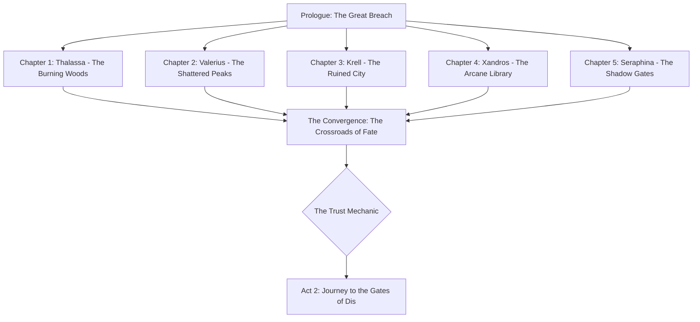

# h-h
##  🛡️ The Vanguard of Earth: The "Gate-Crashers"
Here is our roster of five heroes. We’ve got a mix of heavy hitters, elemental disasters, and one guy who definitely spent too much time in the library.

| Hero | Class | Vibe Check | Combat Style | 
| --- | --- | --- | --- | 
| Thalassa "The Root" | Primal Warden | 🌿 "Step off my lawn... and my planet." | Crowd control with sentient vines and heavy staff slams. | 
| Valerius Bolt | Storm-Crowned Valkyrie | ⚡ "I’m the lightning and the thunder." | High-mobility aerial strikes and piercing lightning spears. | 
| Krell the Unbroken | Runic Juggernaut | 💪 "Does this portal look punchable? Yes." | Raw physical power infused with crackling kinetic runes. | 
| Archivist Xandros | Eldritch Battle-Mage | 📖 "I read about this in a book. It ends badly for you." | Tactical spellcasting, glyph traps, and long-range energy beams. | 
| Seraphina Noir | Hell-Forged Inquisitor | ⚖️ "Trust is hard. Betrayal is easy." | (The wildcard!) Stealth, dual-wielding holy daggers with a demonic edge. | 

## 🗺️ The "How-To-Save-The-World" Pipeline
Since we’re doing the "Individual Origins" approach, here is how the narrative flow looks for the first few acts. It's like a high-stakes group project where nobody knows they're in a group yet! 🤝

## 📝 The Introduction: "Who Left the Door Open?"
The sky didn't fall; it turned the color of a bruised plum and started leaking demons. 😈

It began at High Noon. Across the globe, the "Gates of Gehenna" manifested—towering structures of obsidian and bone that smelled faintly of sulfur and regret. For most people, it was the end of the world. For our heroes, it was a job interview they never applied for.

**Thalassa** is currently busy turning a horde of Hellhounds into fertilizer in the Sacred Grove. 🌳

**Valerius** is playing "dodge the fireball" over the rooftops of a falling capital city. 🏙️

**Krell** is literally holding a portal shut with his bare hands because he’s too angry to let it open. 😤

**Xandros** is frantically looking for a "Dismiss Greater Evil" spell while his library burns around him. 📚

**Seraphina**? She’s watching from the shadows, wondering which side is going to pay better... or which one she’ll have to stab first. 🗡️

The twist? The Heavens aren't coming to help. The Golden Gates are locked tight. It seems the Angels have decided to "work from home" while Earth burns. 😇🚫

Which hero’s perspective are we dropping into first to close their respective gate? 🎮✨

Alright, Player 1! You’ve locked in Valerius Bolt, the human lightning rod with an attitude. ⚡️

We are high above the Shattered Peaks, where the air is thin, the lightning is frequent, and apparently, the demonic GPS is malfunctioning. Valerius is standing on a precarious ledge, spear crackling, when two demons—who look more confused than murderous—stumble out of a shimmering rift. 🌀

## 🎙️ The Dialogue: "Lost in Translation (and Dimensions)"
**Demon A** (a lanky, red-skinned fellow holding a map upside down): "...I’m telling you, Malphas, the instructions said 'Turn left at the screaming void.' Does this look like a screaming void to you?"

**Demon B** (a short, squat imp with wings too small for its body): "It’s too bright, Slag. My eyes are doing that 'burning' thing again, and not the good kind of burning. Hey—look! A local!"

**Valerius**: [Leveling her spear, sparks dancing between her eyes] "Local? I’m the landlord, and your rent is paid in lightning. What are you doing in the Peaks?"

**Slag** (Demon A): "Whoa, whoa! Easy with the glow-stick, lady! We’re looking for the Invasion Point 4-B: The Eternal Buffet. We were told there’d be defenseless villagers and maybe some light arson. This just looks like... rocks. Is this Hell?"

**Valerius**: "This is Earth. And you’re about five seconds away from becoming a charred smudge on these rocks."

**Malphas** (Demon B): "Earth? Ugh, gross. I heard they have 'taxes' and 'social anxiety' there. Look, lady, if you just point us back to the nearest portal, we’ll be out of your hair. We're just interns, honestly. We don't even get dental."

## 🎮 THE CHOICE IS YOURS
Valerius stands at the edge of the cliff. The wind is howling, and her spear is hungry for a discharge. How do we handle these "interns" of the underworld?

| Option | Action | Potential Consequence |
| --- | --- | --- |
| **Option A** | "Shock and Awe" (Fight) | ⚡️ You blast them into soot. But wait! Before the final spark, they'll send a "1-star review" back to Hell, warning everyone that Earth is spicy and needs more reinforcements. |
| **Option B** | "Return to Sender" (Let them go) | 🚪 You let them limp back through the gate and close it behind them. The Catch: They stay alive, and while they seem harmless now, they might just show up at the worst possible moment to ruin your day later. |

## ⚡ PATH A: The "Zap First, Ask Questions Never" Route
In this version, Valerius decides that the only good demon is a grounded one. But these isn't your average trash mobs; they’ve got some tricks up their soot-covered sleeves.

### ⚔️ Battle Encounter: Valerius vs. The Lost Interns

| Entity | Special Skill | Effect |
| --- | --- | --- |
| **Slag** | Insulation Aura | A passive buff that reduces Lightning damage by 50%. 🧤 |
| **Malphas** | Grounding Rod | A channeled ability that redirects Valerius's bolts into the earth. ⚡️🚫 |

**The Fight:**
Valerius lunges, but Slag’s skin turns a dull, rubbery grey. Her spear bounces off! Malphas laughs, planting a jagged iron rod into the cliffside that sucks her chain-lightning right out of the air. It’s a grueling slog, forcing Valerius to use her physical spear-work rather than just her flashy zaps. Eventually, with a devastating overhead slam, she shatters the rod and pierces both demons.

**The Consequences:**
As Malphas coughs up black ichor, he scribbles furiously on a piece of scorched parchment.

"Earth is... cough... spicy. Send the heavy... hitters..." 📝🔥

He tosses it into the air. It turns into a flaming paper plane and zips through the closing rift. On the other side, a massive, four-armed Pit Commander catches it, reads it, and grins. Suddenly, the sky over the Peaks turns blood-red. A Horde is coming for Valerius. 🏃‍♀️💨

## 👣 PATH B: The "Keep Your Enemies Closer" Route
Valerius lowers her spear. "Fine. Close the hole and beat it. If I see you again, I'm making a coat out of your wings." The demons scramble through the rift, babbling thanks.

### 🕵️‍♂️ Stealth Mission: Shadowing the Scurry
Valerius doesn't trust them for a second. She activates Static Cloak (blurring her silhouette) and follows them through the closing portal at the last millisecond.

**The Discovery:**
She follows the two idiots as they hike toward "The Eternal Buffet." It’s not a restaurant. It’s a valley—and it’s crawling with gates.

**The Sight:** Instead of one small breach, there are dozens of obsidian arches.

**The Scale:** Thousands of demons are organizing into ranks. It's not a raid; it's a full-scale colonization. 🛡️👹

**The Realization:** Slag and Malphas were just the tip of the iceberg. Valerius realizes she can't take this on alone. She needs the others.